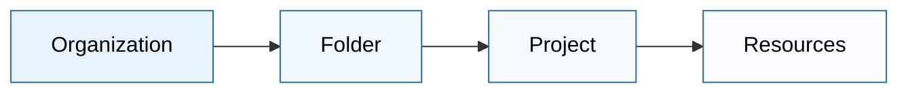
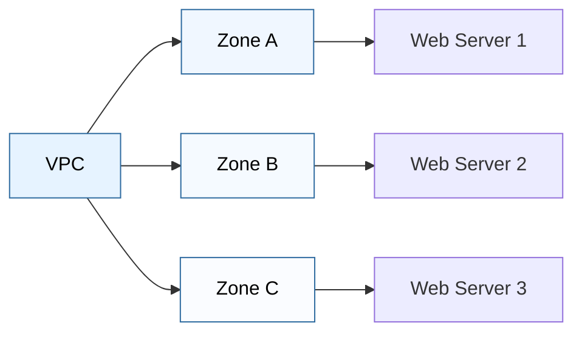
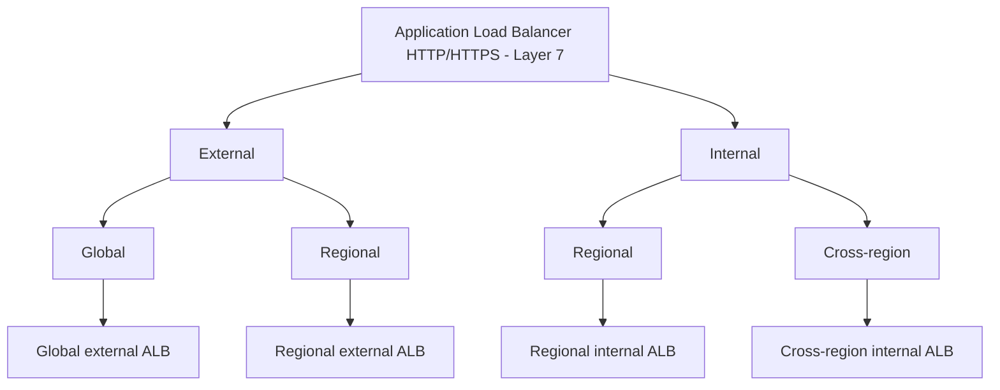
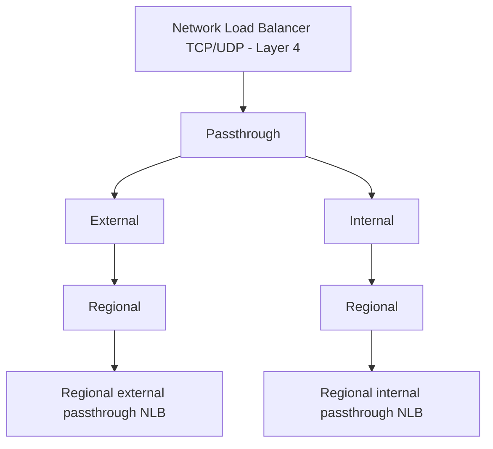
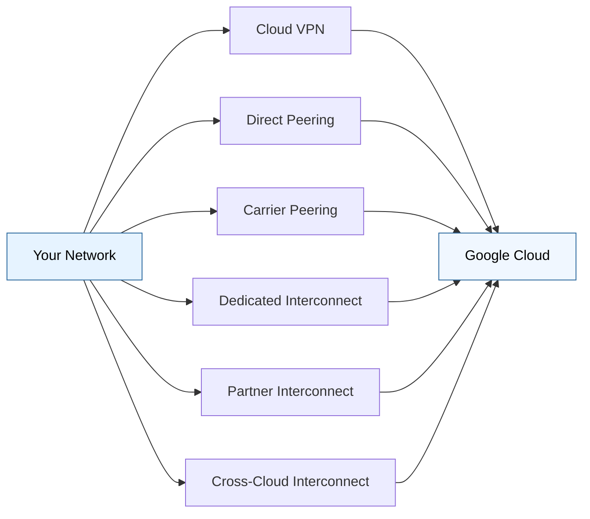

# Google Cloud Platform Core Infrastructure

| Section | Topic | Key Concepts |
|---------|-------|--------------|
| 1 | [Cloud Service Models](#1-cloud-service-models) | • IaaS, PaaS, SaaS, and serverless solutions • Pay-as-you-go and consumption-based models |
| 2 | [Network Architecture](#2-google-cloud-network-architecture) | • 42 regions and 127 availability zones worldwide • Geographic distribution and redundancy |
| 3 | [Security Architecture](#3-security-architecture) | • Six-layer security model • Hardware infrastructure to operational security |
| 4 | [Billing Features](#4-billing-features) | • Per-second billing and sustained use discounts • Budget management and cost optimization |
| 5 | [Resource Hierarchy](#5-resource-hierarchy) | • Organization → Folder → Project → Resources • Policy inheritance and access control |
| 6 | [Identity and Access Management](#6-identity-and-access-management-iam) | • IAM roles and permissions • Service accounts and security best practices |
| 7 | [Cloud Identity](#7-cloud-identity) | • User and device management • Security and compliance features |
| 8 | [Networking and Compute](#8-networking-and-compute) | • VPC architecture and components • VM instances and discount options |
| 9 | [Autoscaling](#9-autoscaling) | • Horizontal and vertical scaling • Load-based and scheduled scaling |
| 10 | [Load Balancing](#10-load-balancing) | • Application (L7) and Network (L4) load balancers • Global and regional load distribution |
| 11 | [DNS and Content Delivery](#11-dns-and-content-delivery) | • Cloud DNS (8.8.8.8) • Edge caching and CDN services |
| 12 | [Network Connectivity Options](#12-network-connectivity-options) | • VPN, Peering, and Interconnect options • Cross-cloud connectivity solutions |

---

## 1. Cloud Service Models
### IAAS-PAAS-SAAS
- **PAAS (Platform as a Service)**: Pay for what you use
- **IAAS (Infrastructure as a Service)**: Pay for what you allocate
- **SAAS (Software as a Service)**: Pay as per service consumption

### Serverless Solutions
- **Cloud Run**: Deploys containerized microservices-based applications in a fully-managed environment
- **Cloud Run Functions**: Manages event-driven code as a pay-as-you-go service

### Similar Services from Other Providers:
- **AWS**: EC2 (IaaS), Elastic Beanstalk (PaaS), AWS Lambda (Serverless)
- **Azure**: Virtual Machines (IaaS), App Service (PaaS), Azure Functions (Serverless)
- **Oracle**: Oracle Cloud Infrastructure (IaaS), Oracle App Service (PaaS), Oracle Functions (Serverless)

## 2. Google Cloud Network Architecture
> 42 Regions | 127 Availability Zones

### Hierarchical Structure
Geo-Location > Regions > Zones

### Geographic Locations
1. North America
   - Example: us-central1
     - us-central1-a
     - us-central1-b
     - us-central1-c
     - us-central1-f
2. South America
   - Example: southamerica-east1
     - southamerica-east1-a
     - southamerica-east1-b
     - southamerica-east1-c
3. Asia
   - Example: asia-east1
     - asia-east1-a
     - asia-east1-b
     - asia-east1-c
4. Europe
   - Example: europe-west2
     - europe-west2-a
     - europe-west2-b
     - europe-west2-c
5. Australia
   - Example: australia-southeast1
     - australia-southeast1-a
     - australia-southeast1-b
     - australia-southeast1-c

> **Notable Achievement**: Google was the first to achieve ISO 14001 certification

### Similar Services from Other Providers:
- **AWS**: 31 Regions, 99 Availability Zones
- **Azure**: 60+ Regions worldwide
- **Oracle**: 44 Cloud Regions, Multiple Availability Domains

## 3. Security Architecture
Google Cloud implements a 6-layer security model:
### 1. Hardware Infrastructure Layer
- Hardware design and provenance: Ensures the integrity and origin of hardware components
- Secure boot stack: Verifies the system's boot process to prevent unauthorized code execution
- Premises security: Physical security measures to protect data centers and hardware

### 2. Service Deployment Layer
- Encryption of inter-service communication: Protects data in transit between services to prevent interception and tampering

### 3. User Identity Layer
- User identity (Login security): Strong authentication mechanisms to verify user identities and secure access

### 4. Storage Layer
- Encryption at rest: Protects stored data by encrypting it, ensuring it remains secure even if accessed without authorization

### 5. Internet Communication Layer
- Google Front End (GFE): A global system that manages and secures traffic between the internet and Google Cloud services
- Denial of Service (DoS) protection: Mechanisms to detect and mitigate DoS attacks, ensuring service availability

### 6. Operational Security Layer
- Intrusion detection: Systems to monitor and detect unauthorized access or anomalies
- Reducing insider risk: Policies and controls to minimize the risk posed by internal threats
- Employee Universal Second Factor (U2F) use: Enforces the use of U2F devices for strong two-factor authentication
- Software development practices: Secure coding standards and practices to prevent vulnerabilities in software

### Similar Security Models from Other Providers:
- **AWS**: Shared Responsibility Model with physical, network, and software security layers
- **Azure**: Defense in depth with 7 layers of security
- **Oracle**: Defense in depth with multiple security layers and Zero Trust architecture

## 4. Billing Features
### Billing Models
- Per-second billing (compute, GKE): Charges are calculated based on the exact number of seconds instances are running, providing cost efficiency.
- Sustained use discounts: Automatically applied discounts for instances that run for a significant portion of the billing month.
  - Instances running more than 25% of the month receive incremental minute discounts, which increase with longer usage, reducing the overall cost.
- Google Cloud Cost Calculator: A tool to estimate and plan your costs by simulating your usage of Google Cloud services.

### Management Tools
- **Budgets**: Set predefined spending limits
- **Alerts**: Customizable budget notifications
- **Reports**: Detailed monthly usage reporting
- **Quotas**: Service-specific limits to prevent misuse

### Similar Billing Features from Other Providers:
- **AWS**: Pay-as-you-go, Reserved Instances, Savings Plans
- **Azure**: Pay-as-you-go, Reserved Instances, Hybrid Benefits
- **Oracle**: Pay-as-you-go, Universal Credits, Bring Your Own License (BYOL)

## 5. Resource Hierarchy

> The resource hierarchy flows from Organization (left) to individual Resources (right), providing a structured approach to resource management and access control.

### Policies and Project Identifiers

- **Policies are downward inherited**: Policies applied at a higher level in the resource hierarchy (e.g., Organization) are inherited by all resources below it (e.g., Folders, Projects, Resources).

### Google Cloud Project Identifiers

Each Google Cloud project has three key identifying attributes:
- **Project ID**: A globally unique identifier assigned by Google Cloud. It is mutable at the time of creation but becomes immutable once set.
- **Project Name**: A user-friendly name for the project. It is mutable and can be changed at any time.
- **Project Number**: A unique, immutable identifier assigned by Google Cloud when the project is created.

### Similar Resource Organization from Other Providers:
- **AWS**: Organization → OU → Account → Resources
- **Azure**: Management Groups → Subscriptions → Resource Groups → Resources
- **Oracle**: Tenancy → Compartments → Resources

## 6.  Identity and Access Management (IAM)

IAM provides fine-grained access control and visibility for centrally managing cloud resources. It includes:

- **Basic Roles**:
  - **Owner**: Full control over all resources.
  - **Editor**: Edit access to all resources.
  - **Viewer**: Read-only access to all resources.
  - **Billing Admin**: Manage billing accounts and payments.

- **Predefined Roles**: Roles that bundle one or more permissions to perform specific actions on Google Cloud resources. These roles are created and maintained by Google Cloud.

- **Custom Roles**: Roles that you can create to tailor permissions to your specific needs, following the principle of least privilege to grant only the necessary permissions required for a job function.

### Service Accounts

Service accounts are special types of Google accounts intended to represent non-human users that need to authenticate and be authorized to access data in Google Cloud services. They are used to provide identities for applications and virtual machines (VMs) to make authorized API calls.

#### Key Points about Service Accounts:

- **Purpose**: Service accounts are used to run workloads on your behalf, such as applications, VMs, or other services that need to interact with Google Cloud APIs.
- **Authentication**: Service accounts use cryptographic keys to authenticate to Google Cloud services. These keys can be managed manually or automatically by Google Cloud.
- **Permissions**: You can assign roles to service accounts to grant them specific permissions. This follows the principle of least privilege, ensuring that service accounts have only the permissions they need.
- **Types of Service Accounts**:
  - **User-managed service accounts**: Created and managed by users. You have full control over these accounts, including their keys and permissions.
  - **Google-managed service accounts**: Automatically created and managed by Google Cloud. These are used by Google Cloud services to perform actions on your behalf.

#### Best Practices:

- **Least Privilege**: Always assign the minimum necessary permissions to service accounts to reduce security risks.
- **Key Management**: Regularly rotate service account keys and avoid embedding keys directly in your code. Use Google Cloud's Secret Manager or other secure storage solutions.
- **Monitoring and Auditing**: Monitor the usage of service accounts and audit their activities to detect any unauthorized access or anomalies.

By understanding and properly managing service accounts, you can ensure secure and efficient access to Google Cloud resources for your applications and services.

## 7. Cloud Identity

Cloud Identity is a service provided by Google Cloud that allows you to manage users, devices, and apps from a central location. It integrates with Google Workspace and other Google Cloud services to provide a unified identity management solution.

### Key Features of Cloud Identity:

- **User Management**: Create, manage, and delete user accounts. Assign roles and permissions to control access to resources.
- **Device Management**: Enforce security policies on devices, such as requiring screen locks and encryption. Monitor device compliance and take action on non-compliant devices.
- **App Management**: Manage access to applications, both Google and third-party apps. Control which apps users can install and use.
- **Security and Compliance**: Implement multi-factor authentication (MFA), single sign-on (SSO), and other security measures to protect user accounts and data. Ensure compliance with industry standards and regulations.

### Similar Identity Services:
- **AWS**: AWS IAM Identity Center (formerly AWS SSO)
- **Azure**: Azure Active Directory (Azure AD)
- **Oracle**: Oracle Identity Cloud Service (IDCS)

## 8. Networking and Compute

### Virtual Private Cloud (VPC)
A VPC is a secure, isolated private cloud computing environment hosted within a public cloud. Think of it as your own private section of Google Cloud, where you can:
- Place and manage your cloud resources (like VMs, databases, etc.)
- Define network policies
- Create secure connections between resources

### Important VPC Components

#### 1. Route Tables
- Acts as a traffic controller for your VPC
- Determines where network traffic is directed
- Contains rules (routes) that determine packet forwarding
- Each subnet must be associated with a route table

#### 2. Firewall Rules
- Controls incoming and outgoing traffic
- Provides network security at the instance and subnet level
- Supports both predefined and custom rules
- Can filter traffic based on:
  - IP addresses
  - Ports
  - Protocols
  - Tags

#### 3. VPC Peering
- Enables direct network connection between two VPCs
- Allows resources to communicate as if they're in the same network
- Benefits:
  - Reduced latency (traffic stays on Google's network)
  - Increased security (no public internet exposure)
  - Cost-effective (internal network pricing)

#### 4. Shared VPC
- Allows an organization to connect resources from multiple projects
- Enables centralized management of network resources
- Benefits:
  - Centralized security management
  - Cost sharing across projects
  - Simplified network administration

### Similar VPC Components from Other Providers:
- **AWS**: 
  - Route Tables
  - Security Groups & Network ACLs
  - VPC Peering
  - AWS Transit Gateway
- **Azure**: 
  - Route Tables
  - Network Security Groups
  - VNet Peering
  - Virtual Network Gateway
- **Oracle**: 
  - Route Tables
  - Security Lists
  - VCN Peering
  - Dynamic Routing Gateway

### Subnets and Zones
#### Subnets
- A subnet is a logical subdivision of your VPC network
- Subnets are **not** exactly the same as zones
- You can have multiple subnets in a single zone, or a subnet that spans multiple zones
- Subnets help you organize and manage your network resources

#### Zones
- Zones are physically separate data centers within a region
- Multiple zones provide high availability and fault tolerance
- If one zone fails, resources in other zones continue operating

### Why Multiple Zones?
- **High Availability**: If one zone fails, services continue running in other zones
- **Disaster Recovery**: Protects against physical disasters affecting a single location
- **Load Distribution**: Distribute traffic and workload across multiple zones

### Real-World Example
Imagine running an e-commerce website:

In this setup:
1. Your VPC contains all your resources
2. Web servers are distributed across three zones
3. If Zone A fails:
   - Web Server 1 goes down
   - Web Servers 2 and 3 continue serving customers
   - Your business continues operating with minimal disruption

### Similar Services from Other Providers:
- **AWS**: Amazon VPC, Availability Zones
- **Azure**: Azure Virtual Network, Availability Zones
- **Oracle**: Oracle Cloud VCN, Availability Domains

### Compute (Virtual Machines)
Google Cloud offers various types of compute resources, primarily through Virtual Machines (VMs) in Compute Engine. These VMs can be customized for different workloads and come with several cost optimization options.

#### Cost Saving Options

1. **Sustained-use Discounts**
   - Automatically applied discounts
   - Based on running instances for a significant portion of the billing month
   - The longer you run instances, the deeper the discount
   - Up to 30% discount for instances running the entire month

2. **Committed-use Discounts**
   - Discounts for committing to use resources for 1 or 3 years
   - Up to 70% discount compared to on-demand pricing
   - Available for most machine types and GPUs
   - Ideal for predictable, steady-state workloads

3. **Preemptible & Spot VMs**
   - **Preemptible VMs**:
     - Up to 80% cheaper than regular instances
     - Can be terminated at any time (max 24-hour runtime)
     - Best for fault-tolerant, batch processing workloads
   
   - **Spot VMs**:
     - Similar to preemptible VMs but with variable pricing
     - Prices fluctuate based on supply and demand
     - No maximum runtime limit
     - Can be terminated when demand increases

#### Best Practices for Cost Optimization
1. Right-size your instances
2. Use appropriate discount types for your workloads
3. Implement auto-scaling
4. Monitor and optimize resource usage

### Similar Services and Discount Options from Other Providers:
- **AWS**: 
  - EC2 Instances
  - Savings Plans
  - Reserved Instances
  - Spot Instances
- **Azure**: 
  - Virtual Machines
  - Reserved VM Instances
  - Spot VMs
  - Hybrid Benefit
- **Oracle**: 
  - Compute Instances
  - Universal Credits
  - Capacity Reservations
  - Preemptible Instances

## 9. Autoscaling

### Overview
Autoscaling automatically adjusts the number of compute instances running your application based on:
- Current demand (CPU usage, request rate)
- Custom metrics
- Schedule-based scaling

### Types of Autoscaling
1. **Horizontal Autoscaling (Scale Out)**
   - Adds/removes VM instances
   - Best for stateless applications

2. **Vertical Autoscaling (Scale Up)**
   - Adjusts machine type (CPU/memory)
   - Useful for stateful applications

### Key Benefits
- Cost optimization
- High availability
- Automatic resource management
- Better performance under varying loads

### Similar Services from Other Providers:
- **AWS**: Auto Scaling Groups, EC2 Auto Scaling
- **Azure**: Virtual Machine Scale Sets
- **Oracle**: Instance Pools, Autoscaling Configurations

## 10. Load Balancing

### Cloud Load Balancing
Google Cloud Load Balancing is a fully distributed, software-defined managed service that offers:
- Multi-protocol support (HTTP, HTTPS, TCP, SSL, UDP)
- Cross-region load distribution
- No pre-warming required
- Automatic scaling and high availability

### Types of Load Balancers

#### 1. Application Load Balancer (Layer 7)  || HTTP/HTTPS

#### 2. Network Load Balancer (Layer 4) || TCP/UDP/ Other IP Protocols

### Key Features
- **Global Load Balancing**: Distribute traffic across regions
- **Automatic Scaling**: Handles traffic spikes without manual intervention
- **Health Checking**: Automatic monitoring of backend services
- **SSL/TLS Termination**: Handles HTTPS traffic and certificate management

### Similar Services from Other Providers:
- **AWS**: 
  - Application Load Balancer (ALB)
  - Network Load Balancer (NLB)
  - Classic Load Balancer
- **Azure**: 
  - Application Gateway
  - Load Balancer
  - Traffic Manager
- **Oracle**: 
  - Load Balancer
  - Traffic Management

## 11. DNS and Content Delivery

### Cloud DNS (8.8.8.8)
Google's public DNS service (8.8.8.8) is one of the world's most widely used DNS resolvers. In Google Cloud, Cloud DNS provides:
- Highly available and scalable DNS serving
- Low-latency DNS queries
- Managed DNS service for Google Cloud resources
- Support for public and private zones

### Edge Caching
Edge caching brings content closer to users by storing it at Google's edge locations worldwide:
- Reduces latency by serving content from the nearest location
- Decreases load on backend servers
- Improves user experience
- Automatically optimizes content delivery paths

### Cloud CDN (Content Delivery Network)
Google Cloud CDN uses Google's global edge network to serve content closer to users:

#### Key Features
- **Low Latency**: Content served from nearest edge location
- **Reduced Load**: Backend servers handle fewer direct requests
- **Automatic Optimization**: 
  - Smart caching
  - Compression
  - Cache invalidation
  - SSL/TLS termination

#### Benefits
1. **Performance**:
   - Faster content delivery
   - Reduced response times
   - Better user experience

2. **Cost Efficiency**:
   - Reduced egress costs
   - Lower backend processing
   - Optimized resource usage

3. **Security**:
   - DDoS protection
   - SSL/TLS encryption
   - Token-based authentication

### Similar Services from Other Providers:
- **AWS**: 
  - Route 53 (DNS)
  - CloudFront (CDN)
  - Global Accelerator
- **Azure**: 
  - Azure DNS
  - Azure CDN
  - Front Door
- **Oracle**: 
  - Oracle DNS
  - Oracle CDN
  - Edge Services

## 12. Network Connectivity Options

### Cloud VPN
- Uses Cloud Router for dynamic routing
- Implements Border Gateway Protocol (BGP)
- Secure, encrypted tunnel over public internet
- Cost-effective for lower bandwidth needs

### Direct Peering
- Places a router in the same public datacenter as a Google Point of Presence (PoP)
- Access to over 100+ Google PoPs worldwide
- Direct access to Google's network infrastructure
- Good for high-bandwidth, reliable connectivity

### Carrier Peering
- Direct access from on-premises network through a service provider's network
- **Note**: Not covered by Google Service Level Agreement
- Useful when working with existing carrier relationships
- Managed through service provider

### Dedicated Interconnect
- One or more direct, private connections to Google
- Highest reliability and security
- **SLA**: 99.999% availability
- Best for mission-critical workloads

### Partner Interconnect
- Solution for locations that can't reach a Dedicated Interconnect location
- Connects through a supported service provider
- **SLA**: 99.99% availability
- Flexible connectivity options

### Cross-Cloud Interconnect
- Enables high-bandwidth multi-cloud connectivity
- Supports integrated multi-cloud strategy
- Connection sizes:
  - 10 Gbps
  - 100 Gbps
- Direct, private connections between clouds

### Similar Services from Other Providers:
- **AWS**: 
  - Direct Connect
  - Site-to-Site VPN
  - Transit Gateway
- **Azure**: 
  - ExpressRoute
  - VPN Gateway
  - Virtual WAN
- **Oracle**: 
  - FastConnect
  - VPN Connect
  - Cross-Connect